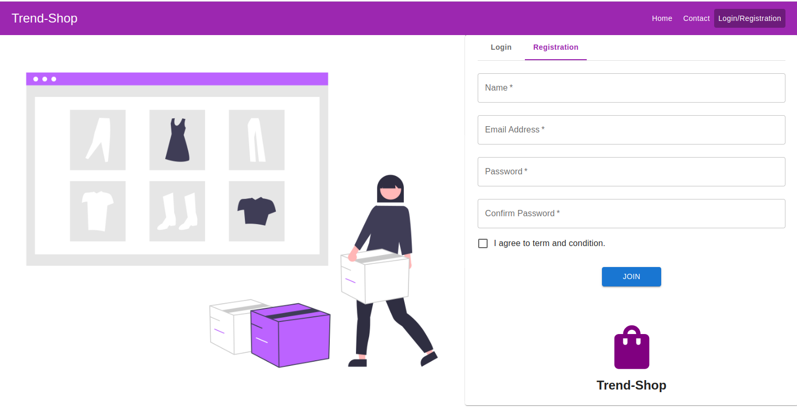

# Express ReactJs Authenetication

## 📃 Description

Express & React Authentication System

This project is a full-stack authentication system developed with [Express](https://www.npmjs.com/package/express) for the backend and [React](https://react.dev/) for the frontend. It provides secure user authentication, including registration, login, and email verification, with encrypted passwords managed by [bcrypt](https://www.npmjs.com/package/bcrypt) and [jsonwebtoken](https://www.npmjs.com/package/jsonwebtoken) for token-based session management. [Mongoose](https://www.npmjs.com/package/mongoose) is used to interact with a MongoDB database, while [nodemailer](https://www.npmjs.com/package/nodemailer) sends verification and password recovery emails. On the front end, React and [React-Redux](https://redux.js.org/) handle state management and user interface, with [React Router](https://www.npmjs.com/package/react-router-dom) managing navigation. [CORS](https://www.npmjs.com/package/cors) enables secure cross-origin requests, and [dotenv](https://www.npmjs.com/package/dotenv) protects sensitive configuration data. Web Vitals is also included to monitor performance, ensuring a fast and reliable user experience. This project is ideal for understanding secure authentication, API communication, and state management in a modern web application.

## ⚙️ Requirements

- [Npm](https://www.npmjs.com/package/download)
- [Express](https://expressjs.com/)
- [Nodejs](https://nodejs.org/en/download)

#### Steps to create project and install required module:

#### step 1: Start the project using the following command in your project folder:

  + `npm init`
  
#### 📥 Step 2: Install the required modules using following command for Back-end:

  + `express`
  + `bcrypt`
  + `cors`
  + `dotenv`
  + `express`
  + `jsonwebtoken`
  + `mongoose`
  + `nodemailer`
  + `nodemon`
  
#### 📥 Step 3: Install the required modules using following command for Front-end:

+ `react`
+ `react-dom`
+ `react-redux`
+ `react-router-dom`
+ `react-scripts`
+ `web-vitals`

#### Step 4: Create two folders inside the project directory using the following command:

+ `mkdir models`
+ `mkdir controllers`
+ `mkdir config`
+ `mkdir middlewares`
+ `mkdir routes`

#### Step 5: Create another file named app.js inside project directory:

+ `touch app.js`

### 🌟 Run the application -

#### Type the following command in terminal of your project directory:

+ `npm start`

## 📺 Output:

